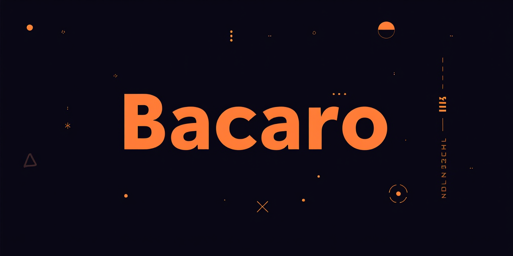

# Bacaro — Where your processes share a round



[](https://github.com/bricke/bacaro/actions/workflows/ci.yml)
[](LICENSE)

A reliable, brokerless message bus for single-machine use. Processes publish named properties and subscribe to the domains they care about. Each process maintains a local cache — no central broker, no single point of failure.

Inspired by D-Bus, built on ZeroMQ.

## Quick start

```sh
sudo apt-get install -y pkg-config libzmq3-dev
cmake -B build -DCMAKE_BUILD_TYPE=Debug
cmake --build build
ctest --test-dir build --output-on-failure
```

## Documentation

| Document | Description |
|---|---|
| [Concepts](docs/concepts.md) | Properties, domains, brokerless design, late-join, wire format |
| [API Reference](docs/api.md) | Full API, memory ownership, usage example |
| [Getting Started](docs/getting-started.md) | Dependencies, build options, tests, environment variables |
| [Tools](docs/tools.md) | `oste` (monitor) and `vecio` (property setter) |
| [Architecture](docs/architecture.md) | Internal design: discovery, dispatch, snapshot protocol, cache |

## Dependencies

| Dependency | Version | How |
|---|---|---|
| [libzmq](https://zeromq.org/) | 4.x | System package |
| [msgpack-c](https://github.com/msgpack/msgpack-c) | cpp-6.1.1 | CMake `FetchContent` |
| [doctest](https://github.com/doctest/doctest) | v2.4.11 | CMake `FetchContent`, tests only |

## License

[MIT](LICENSE) — Copyright 2021 Matteo Brichese
